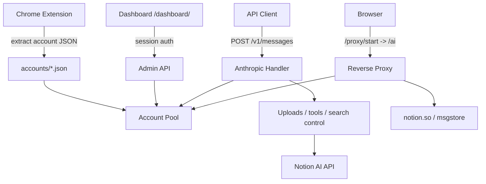

<div align="center">
  <h1>notion-manager</h1>
  <p><strong>Local account pool, dashboard, and protocol proxy for Notion AI</strong></p>
  <p>Run multiple Notion sessions behind one local entrypoint with pooled accounts, quota visibility, a browser dashboard, and an Anthropic-compatible API.</p>

  <p>
    
    
    
    
  </p>

  <p>
    <a href="#core-capabilities">Core Capabilities</a> •
    <a href="#architecture">Architecture</a> •
    <a href="#setup">Setup</a> •
    <a href="#documentation">Documentation</a>
  </p>

  <p>
    <strong>English</strong> |
    <a href="./README_CN.md">简体中文</a>
  </p>
</div>

---

<p align="center">
  
</p>

**notion-manager** is a local Notion AI management tool. It extracts live Notion sessions through the bundled Chrome extension, builds a multi-account pool, refreshes quota and model state in the background, and exposes three practical entrypoints:

- `Dashboard` at `/dashboard/`
- `Reverse Proxy` for the full Notion AI web UI at `/ai`
- `Anthropic Messages API` at `POST /v1/messages`

## Core Capabilities

### Multi-account pool

- Load any number of account JSON files from `accounts/`
- Pick accounts by effective remaining quota instead of naive random routing
- Skip exhausted accounts automatically
- Persist refreshed quota and discovered models back into account JSON files
- Use a separate account selection path for researcher mode

### Dashboard

- Embedded React dashboard at `/dashboard/`
- Password login with session cookies
- View account status, plans, quota, discovered models, and refresh progress
- Toggle `enable_web_search`, `enable_workspace_search`, and `debug_logging`
- Open the best available account or a specific account into the local proxy

### Reverse proxy for Notion Web

- Create a targeted proxy session through `/proxy/start`
- Open the full Notion AI experience locally through `/ai`
- Inject pooled account cookies automatically
- Proxy HTML, `/api/*`, static assets, `msgstore`, and WebSocket traffic
- Rewrite Notion frontend base URLs and strip analytics scripts

### Anthropic-compatible API

- `POST /v1/messages`
- Supports both `Authorization: Bearer <api_key>` and `x-api-key: <api_key>`
- Streaming and non-streaming responses
- Anthropic `tools`
- File content blocks for images, PDFs, and CSVs
- Default model fallback via `proxy.default_model`

<p align="center">
  <br>
  <em>Works with <a href="https://github.com/CherryHQ/cherry-studio">Cherry Studio</a> — a multi-LLM desktop client</em>
</p>

### Research mode and search control

- Use `researcher` or `fast-researcher` as the model name
- Streams thinking blocks and final report text
- Request-level search control via `X-Web-Search` and `X-Workspace-Search`
- Search precedence is request headers > dashboard/config > defaults

## Architecture



## Setup

### Requirements

- Go `1.25+`
- Chrome or Chromium for the extension workflow
- At least one usable Notion account

The repo already includes embedded dashboard assets, so `go run` is enough if you only want to run the service.

### 1. Extract account configs

1. Open `chrome://extensions`
2. Enable developer mode
3. Load `chrome-extension/`
4. Open a logged-in `https://www.notion.so/`
5. Click the extension and extract the config
6. Save the result into `accounts/<name>.json`

Example:

```text
accounts/
  alice.json
  team-a.json
  backup.json
```

### 2. Configure `config.yaml`

Copy the example config and edit as needed:

```bash
cp example.config.yaml config.yaml
```

- `server.port` sets the listening port
- `server.admin_password` can be set manually or left empty for auto-generation

You can also skip this step entirely — the service will start with defaults and auto-generate `config.yaml` with a random API key and admin password.

Important:

- If `server.api_key` is empty, startup generates one and writes it back to `config.yaml`
- If `server.admin_password` is empty, startup generates a random password, prints it to the console, hashes it, and writes it back — save the plaintext shown on first run
- If `server.admin_password` is plaintext, startup replaces it with a salted SHA256 hash

### 3. Run

```bash
go run ./cmd/notion-manager
```

If you change the dashboard source under `web/`, rebuild it with `npm run build` inside `web/`, then sync the output into `internal/web/dist/`.

Examples below use port `3000` from `example.config.yaml`. If you start without a `config.yaml`, the default port is `8081`.

### 4. Verify

```bash
curl http://localhost:3000/health
```

Open:

```text
http://localhost:3000/dashboard/
```

Basic API call:

```bash
curl http://localhost:3000/v1/messages \
  -H "Authorization: Bearer <api_key>" \
  -H "Content-Type: application/json" \
  -d '{
    "model": "sonnet-4.6",
    "max_tokens": 512,
    "messages": [
      { "role": "user", "content": "Summarize what notion-manager does." }
    ]
  }'
```

## Documentation

- [API Usage](docs/api.md) — Standard requests, search overrides, file uploads, research mode
- [Dashboard & Proxy](docs/dashboard.md) — Dashboard login, proxy session workflow
- [Configuration](docs/configuration.md) — Full config reference, endpoints, notes

## License

This project is licensed under [CC BY-NC-SA 4.0](https://creativecommons.org/licenses/by-nc-sa/4.0/). Non-commercial use only.
