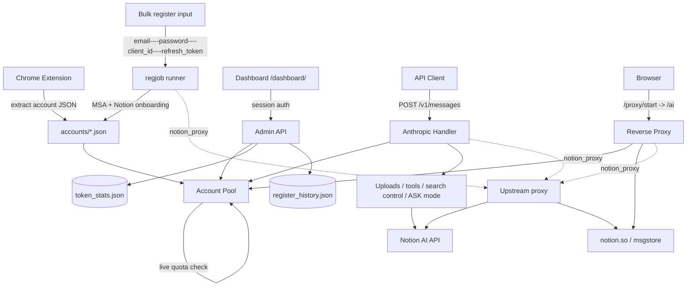

<div align="center">
  <h1>notion-manager</h1>
  <p><strong>Local account pool, dashboard, and protocol proxy for Notion AI</strong></p>
  <p>Run multiple Notion sessions behind one local entrypoint with pooled accounts, quota visibility, a browser dashboard, an Anthropic-compatible API, bulk Microsoft-SSO account provisioning, and Claude Code compatibility.</p>

  <p>
    
    
    
    
    
  </p>

  <p>
    <a href="#quick-start">Quick Start</a> •
    <a href="#core-capabilities">Core Capabilities</a> •
    <a href="#architecture">Architecture</a> •
    <a href="#setup">Setup</a> •
    <a href="#documentation">Documentation</a>
  </p>

  <p>
    <strong>English</strong> |
    <a href="./README_CN.md">简体中文</a>
  </p>
</div>

---

<p align="center">
  
</p>

**notion-manager** is a local Notion AI management tool. It extracts live Notion sessions through the bundled Chrome extension (or provisions fresh ones via bulk Microsoft-SSO), builds a multi-account pool, refreshes quota and model state in the background, and exposes four practical entrypoints:

- `Dashboard` at `/dashboard/` — pool view, token usage stats, bulk register
- `Reverse Proxy` for the full Notion AI web UI at `/ai`
- `API gateway` — `POST /v1/messages` (Anthropic), `POST /v1/chat/completions`, `POST /v1/responses`, `GET /v1/models` (OpenAI), with `GET /models` as an alias
- `Bulk register` at `POST /admin/register/start` (provider-pluggable)

## Quick Start

> **Prerequisites:** Go 1.25+, at least one Notion account. No Chrome extension needed if you only plan to add accounts via the dashboard.

```bash
# 1. Clone & run (config auto-generated on first start)
git clone https://github.com/SleepingBag945/notion_manager.git
cd notion_manager
go run ./cmd/notion-manager
```

On first run, the console prints your **admin password** and **API key** — save them.

```bash
# 2. Open the Dashboard
http://localhost:8081/dashboard/
```

**Add your first account** (pick one):

- **Existing Notion session** — In Chrome open `notion.so` → `F12` → **Application** → **Cookies** → copy `token_v2`. In the Dashboard click **「+ 添加账号」** and paste it.
- **Bulk Microsoft-SSO** — In the Dashboard click **「注册账号」** and paste `email----password----client_id----refresh_token` lines. See [Bulk Registration](docs/registration.md) for credential prep.

The pool hot-reloads as soon as a new JSON lands in `accounts/` — no restart needed.

```bash
# 3. Use the API (Claude Code, Cherry Studio, curl, etc.)
export ANTHROPIC_BASE_URL=http://localhost:8081
export ANTHROPIC_API_KEY=<your-api-key>
claude  # or any Anthropic-compatible client

# OpenAI-compatible clients hit the same server:
export OPENAI_BASE_URL=http://localhost:8081/v1
export OPENAI_API_KEY=<your-api-key>
```

Or download a pre-built binary from [Releases](https://github.com/SleepingBag945/notion_manager/releases) — no Go toolchain required.

---

## Core Capabilities

### Multi-account pool

- Load any number of account JSON files from `accounts/`
- Pick accounts by effective remaining quota instead of naive random routing
- Live per-request quota check (cached for `refresh.live_check_seconds`) so an account that just exhausted doesn't poison the next call
- Skip exhausted / no-workspace accounts automatically
- Persist refreshed quota and discovered models back into account JSON files
- Use a separate account selection path for researcher mode

### Dashboard

- Embedded React dashboard at `/dashboard/`
- Password login with session cookies
- Pool view with **server-side search, sort, and pagination** (`q`, `page`, `page_size`)
- Per-account actions: open proxy, copy token, **delete account file + pool entry**
- Token usage statistics page — lifetime totals, today, last 24h, 30-day series, top-N models, top-N accounts
- Toggle `enable_web_search`, `enable_workspace_search`, `ask_mode_default`, `debug_logging`
- Edit upstream `notion_proxy` URL at runtime without a restart
- **Bulk register drawer** with per-job concurrency, optional per-job upstream proxy, live SSE progress, and one-click retry of failed rows

### Reverse proxy for Notion Web

- Create a targeted proxy session through `/proxy/start`
- Open the full Notion AI experience locally through `/ai`
- Inject pooled account cookies automatically
- Proxy HTML, `/api/*`, static assets, `msgstore`, and WebSocket traffic
- Rewrite Notion frontend base URLs and strip analytics scripts
- Refuse to redirect into an account whose Notion workspace is missing (returns `409` so the dashboard can show the user instead of opening a dead tab)

### API compatibility (Anthropic + OpenAI)

- `POST /v1/messages` — Anthropic Messages API
- `POST /v1/chat/completions` — OpenAI Chat Completions API
- `POST /v1/responses` — OpenAI Responses API
- `GET /v1/models` — OpenAI models API
- `GET /models` — compatibility alias for `/v1/models`
- Supports both `Authorization: Bearer <api_key>` and `x-api-key: <api_key>`
- Streaming and non-streaming responses
- Anthropic `tools` and OpenAI `tools` / `function_call`
- File inputs for images, PDFs, and CSVs reuse the existing Notion upload pipeline
- Default model fallback via `proxy.default_model`
- `previous_response_id` is intentionally unsupported in `/v1/responses` (stateless bridge)
- **ASK mode** — append `-ask` to any model name (e.g. `sonnet-4.6-ask`) for a read-only single turn that mirrors Notion's frontend "Ask" toggle, or set `proxy.ask_mode_default: true` to make every request ASK by default

### Bulk Microsoft-SSO registration

- Provision Notion accounts in bulk by feeding `email----password----client_id----refresh_token` lines
- Drives the full MSA → Notion onboarding flow (consent, MFA proofs via paired peer mailbox, space creation, plan probe)
- Provider-pluggable architecture (`internal/regjob/providers/...`) — Microsoft is the first provider; future OAuth integrations (Google, GitHub, …) drop in via the same interface
- Per-job upstream proxy (HTTP/HTTPS/SOCKS5) — beats the global `proxy.notion_proxy`
- Live job state persisted to `accounts/.register_history.json`; SSE event stream at `/admin/register/jobs/{id}/events`
- One-click retry of just the failed rows (raw inputs preserved sidecar-style)
- Standalone CLI mirror at `cmd/register/` (pipe credentials via stdin or `-input`)

See [Bulk Registration](docs/registration.md) for the protocol, schema, and dashboard walkthrough.

### Upstream proxy for all Notion traffic

- `proxy.notion_proxy` (env `NOTION_PROXY`, dashboard editable) tunnels every Notion-bound HTTPS connection — `/v1/messages`, `/admin/refresh`, `/ai` reverse proxy, `msgstore`, WebSocket, **and** the bulk-register MSA flow
- Schemes: `http`, `https`, `socks5`, `socks5h`
- **Docker note**: If running in Docker, use `host.docker.internal` instead of `127.0.0.1` to access a proxy on the host machine (e.g. `http://host.docker.internal:7890`), and ensure "Allow LAN connections" is enabled in your proxy software.
- Per-bulk-register-job override available in the dashboard register modal; empty modal value falls back to the global URL

### Token usage statistics

- `GET /admin/stats` — lifetime + today + last 24h + 30-day daily series + top-5 models + top-5 accounts
- Persisted to `accounts/.token_stats.json`, flushed every 5 s, survives restarts
- Recorded automatically on every successful inference (no extra wiring required)

<p align="center">
  <br>
  <em>Works with <a href="https://github.com/CherryHQ/cherry-studio">Cherry Studio</a> — a multi-LLM desktop client</em>
</p>

### Claude Code Integration

Compatible with [Claude Code](https://docs.anthropic.com/en/docs/claude-code) — Anthropic's official agentic coding tool. Multi-turn tool chaining, file operations, shell commands, and extended thinking work through Notion AI via a [three-layer compatibility bridge](docs/claude-code-integration.md).

<p align="center">
  <br>
  <em>Claude Code analyzing project architecture through notion-manager — multi-turn tool chaining with session persistence</em>
</p>

<p align="center">
  <br>
  <em>Extended thinking support — Claude Code's reasoning chain is fully streamed</em>
</p>

**Setup** — just two environment variables:

```bash
export ANTHROPIC_BASE_URL=http://localhost:8081
export ANTHROPIC_API_KEY=your-api-key
claude  # start interactive session
```

**What works**: Shell commands, file read/write/edit, file search (Glob/Grep), web search, multi-turn tool chaining, extended thinking, streaming, model selection (Opus/Sonnet/Haiku).

**How it works**: Notion AI's ~27k server-side system prompt creates a strong "I am Notion AI" identity that refuses external tool calls. The proxy bypasses this by (1) dropping conflicting system prompts, (2) stripping XML control tags, and (3) reframing requests as code generation ("unit test" framing). A `__done__` pseudo-function keeps the model permanently in JSON output mode — it never switches to "respond as assistant" mode, which would trigger Notion AI identity regression. See [Claude Code Integration Details](docs/claude-code-integration.md) for the full technical explanation and [Notion's system prompt](docs/notion_system_prompt.md).

**Limitations**: Only 8 core tools (of 18+) are supported (larger tool lists break the framing), latency is higher per turn, and management tools (Agent, MCP, LSP) are filtered out.

### Research mode and search control

- Use `researcher` or `fast-researcher` as the model name
- Streams thinking blocks and final report text
- Request-level search control via `X-Web-Search` and `X-Workspace-Search`
- Search precedence is request headers > dashboard/config > defaults

## Architecture



## Setup

### Requirements

- Go `1.25+` (or grab a [Release](https://github.com/SleepingBag945/notion_manager/releases) pre-built binary if you want to skip the Go toolchain)
- Chrome or Chromium for the extension workflow (skip if you only use the dashboard "Add account" or bulk register)
- At least one usable Notion account

The repo already includes embedded dashboard assets, so `go run` is enough if you only want to run the service.

### 1. Get accounts into the pool

You have two parallel ways to populate `accounts/`. Mix and match — the pool just loads whatever JSON files end up in the directory.

#### Option A — Chrome extension (existing logged-in sessions)

1. Open `chrome://extensions`
2. Enable developer mode
3. Load `chrome-extension/`
4. Open a logged-in `https://www.notion.so/`
5. Click the extension and extract the config
6. Save the result into `accounts/<name>.json`

#### Option B — Bulk Microsoft-SSO registration (fresh accounts)

Drive the dashboard's `+ Register` drawer or the standalone CLI:

```bash
# CLI: drop one line per account into stdin or -input
notion-manager-register -accounts ./accounts -input creds.txt
```

Each line has four fields, separated by `----`:

```text
<email>----<password>----<client_id>----<refresh_token>
```

The runner pairs adjacent rows for second-factor email proofs (row N's mailbox is used as N+1's verification target), so always paste credentials in **even** counts. See [Bulk Registration](docs/registration.md) for the full flow, retry semantics, and dashboard SSE protocol.

Example pool layout:

```text
accounts/
  alice.json                 # from the Chrome extension
  alice_outlook_com.json     # from bulk register (filename derived from email)
  team-a.json
  backup.json
```

### 2. Configure `config.yaml`

Copy the example config and edit as needed:

```bash
cp example.config.yaml config.yaml
```

- `server.port` sets the listening port
- `server.admin_password` can be set manually or left empty for auto-generation

You can also skip this step entirely — the service will start with defaults and auto-generate `config.yaml` with a random API key and admin password.

Important:

- If `server.api_key` is empty, startup generates one and writes it back to `config.yaml`
- If `server.admin_password` is empty, startup generates a random password, prints it to the console, hashes it, and writes it back — save the plaintext shown on first run
- If `server.admin_password` is plaintext, startup replaces it with a salted SHA256 hash

### 3. Run

```bash
go run ./cmd/notion-manager
```

If you change the dashboard source under `web/`, rebuild it with `npm run build` inside `web/`, then sync the output into `internal/web/dist/`.

Examples below use port `3000` from `example.config.yaml`. If you start without a `config.yaml`, the default port is `8081`.

### 4. Verify

```bash
curl http://localhost:3000/health
```

Open:

```text
http://localhost:3000/dashboard/
```

Basic API call:

```bash
curl http://localhost:3000/v1/messages \
  -H "Authorization: Bearer <api_key>" \
  -H "Content-Type: application/json" \
  -d '{
    "model": "sonnet-4.6",
    "max_tokens": 512,
    "messages": [
      { "role": "user", "content": "Summarize what notion-manager does." }
    ]
  }'
```

## Documentation

- [API Usage](docs/api.md) — Standard requests, OpenAI compatibility, search overrides, file uploads, research mode, ASK mode
- [Dashboard & Proxy](docs/dashboard.md) — Dashboard login, pool view, register drawer, stats panel, proxy session workflow
- [Bulk Registration](docs/registration.md) — Microsoft-SSO provisioning, providers, jobs, SSE, retry, sidecar inputs
- [Configuration](docs/configuration.md) — Full config reference, endpoints, environment variables
- [Claude Code Integration](docs/claude-code-integration.md) — How Claude Code works through Notion AI, capabilities, and limitations
- [Notion System Prompt](docs/notion_system_prompt.md) — Notion AI's full server-side system prompt (~27k tokens)

## License

This project is licensed under [CC BY-NC-SA 4.0](https://creativecommons.org/licenses/by-nc-sa/4.0/). Non-commercial use only.
