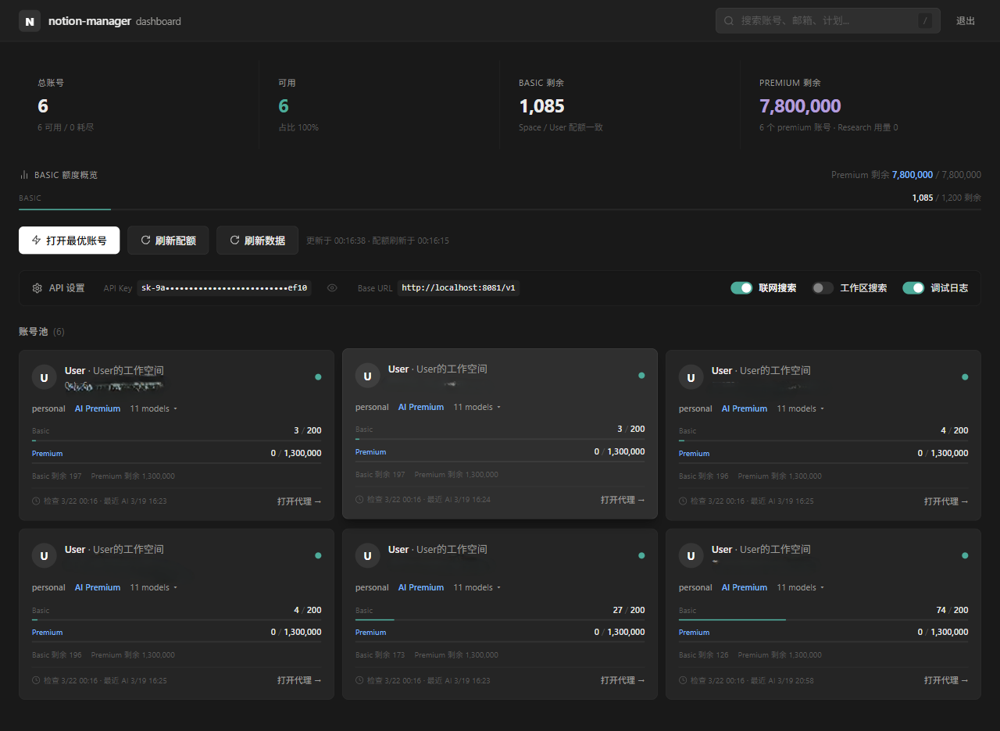
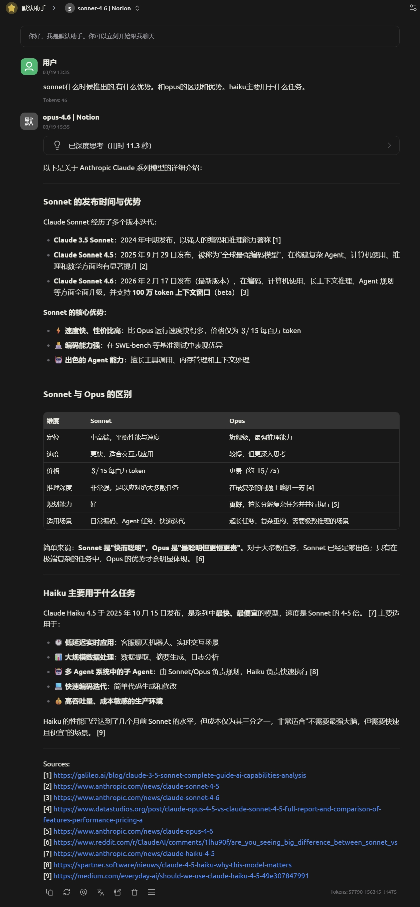
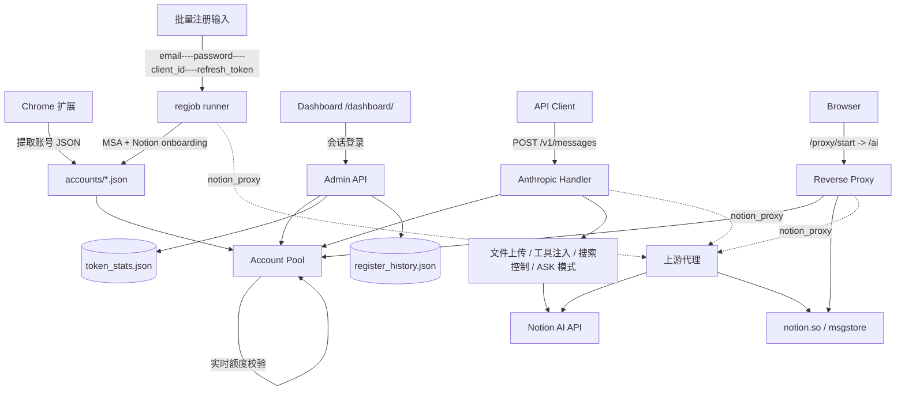

<div align="center">
  <h1>notion-manager</h1>
  <p><strong>Notion AI 多账号池、Dashboard 与本地协议代理</strong></p>
  <p>多账号集中管理：账号池化、额度监控、API 代理、Web 代理、Microsoft SSO 批量注册、上游代理转发，并兼容 Claude Code。</p>

  <p>
    
    
    
    
    
  </p>

  <p>
    <a href="#快速开始">快速开始</a> •
    <a href="#核心能力">核心能力</a> •
    <a href="#系统架构">系统架构</a> •
    <a href="#安装与启动">安装与启动</a> •
    <a href="#详细文档">详细文档</a>
  </p>

  <p>
    <a href="./README.md">English</a> |
    <strong>简体中文</strong>
  </p>
</div>

---

<p align="center">
  
</p>

**notion-manager** 是一个本地运行的 Notion AI 管理工具。它通过自带的 Chrome 扩展提取 Notion 会话，或者用 Microsoft SSO 批量注册全新账号，构建多账号池，在后台自动刷新额度与模型状态，并对外提供四个入口：

- `Dashboard`：账号池、Token 用量统计、批量注册抽屉
- `Reverse Proxy`：在本地浏览器中直接使用完整的 Notion AI 页面（`/ai`）
- `API 网关`：`POST /v1/messages`（Anthropic）、`POST /v1/chat/completions`、`POST /v1/responses`、`GET /v1/models`（OpenAI），`GET /models` 为兼容别名
- `批量注册`：`POST /admin/register/start`，Provider 抽象（已内置 Microsoft）

## 快速开始

> **前置要求：** Go 1.25+，至少一个 Notion 账号。如果只用 Dashboard 添加账号，可以不用安装 Chrome 扩展。

```bash
# 1. 克隆并启动（首次启动自动生成配置）
git clone https://github.com/SleepingBag945/notion_manager.git
cd notion_manager
go run ./cmd/notion-manager
```

首次启动时控制台会打印 **管理密码** 和 **API Key** —— 请务必保存。

```bash
# 2. 打开 Dashboard
http://localhost:8081/dashboard/
```

**添加第一个账号**（任选其一）：

- **已登录的 Notion 会话** —— 在 Chrome 打开 `notion.so` → `F12` → **Application** → **Cookies** → 复制 `token_v2`，在 Dashboard 点击 **「+ 添加账号」** 粘贴即可。
- **Microsoft SSO 批量注册** —— 在 Dashboard 点击 **「注册账号」**，粘贴 `email----password----client_id----refresh_token` 多行凭据。凭据准备方式见 [批量注册文档](docs/registration_cn.md)。

只要有新的 JSON 文件落到 `accounts/` 下，账号池会自动热加载，无需重启。

```bash
# 3. 调用 API（Claude Code、Cherry Studio、curl 等）
export ANTHROPIC_BASE_URL=http://localhost:8081
export ANTHROPIC_API_KEY=<your-api-key>
claude  # 或任何 Anthropic 兼容客户端

# OpenAI 兼容客户端走同一服务：
export OPENAI_BASE_URL=http://localhost:8081/v1
export OPENAI_API_KEY=<your-api-key>
```

也可以直接从 [Releases](https://github.com/SleepingBag945/notion_manager/releases) 下载预编译二进制，无需 Go 工具链。

---

## 核心能力

### 1. 多账号池与自动故障转移

- 从 `accounts/` 目录加载任意数量的账号 JSON
- 按账号剩余额度优先分配请求，而不是简单随机轮询
- **请求级实时额度校验**（默认 5s 缓存，由 `refresh.live_check_seconds` 控制）：刚被打满的账号不会污染下一次调用
- 自动跳过额度耗尽 / 没有 workspace 的账号
- 付费账号在后续刷新时可自动恢复
- 研究模式会单独选择更适合的账号，优先避开研究额度已紧张的账号
- 配额和已发现模型会持久化回写到账号 JSON

### 2. Dashboard 管理面板

- 内置 React Dashboard，入口为 `/dashboard/`
- 支持密码登录、会话维持与登出
- 账号列表服务端**搜索 / 排序 / 分页**（`q`、`page`、`page_size`）
- 单个账号操作：打开代理、复制 token、**删除（含磁盘 JSON 与池内对象）**
- **Token 用量统计页**：累计、今日、最近 24 小时、近 30 天日序列、Top‑N 模型 / Top‑N 账号
- 可在页面内切换 `enable_web_search`、`enable_workspace_search`、`ask_mode_default`、`debug_logging`
- 可在线编辑 `notion_proxy`，无需重启即可生效
- **批量注册抽屉**：可设置每批并发、单批上游代理；通过 SSE 实时显示进度；失败行可一键重试（凭据从 sidecar 还原，无需重新粘贴）
- 一键打开“最佳账号”代理，或指定邮箱打开账号代理（原版 Notion AI 体验）

### 3. 本地 Notion Web 反向代理

- 入口为 `/ai`
- 通过 `/proxy/start` 为指定账号创建会话，再进入完整的 Notion AI Web 界面
- 自动注入账号 Cookie，不需要在代理页重新登录
- 转发 Notion HTML、`/api/*`、静态资源、`msgstore` 和 WebSocket
- 会动态改写 `CONFIG.domainBaseUrl`，并过滤分析脚本
- 对没有 workspace 的账号直接返回 `409`，避免 Dashboard 把用户带进“无限骨架屏”的死页

### 4. API 协议兼容层（Anthropic + OpenAI）

- `POST /v1/messages` —— Anthropic Messages API
- `POST /v1/chat/completions` —— OpenAI Chat Completions API
- `POST /v1/responses` —— OpenAI Responses API
- `GET /v1/models` —— OpenAI Models API
- `GET /models` —— `/v1/models` 的兼容别名
- 同时支持 `Authorization: Bearer <api_key>` 和 `x-api-key: <api_key>`
- 支持流式与非流式响应
- 同时支持 Anthropic `tools` 与 OpenAI `tools` / `function_call`
- 图片、PDF、CSV 文件输入会复用现有的 Notion 上传链路
- 请求里未指定 `model` 时，自动回退到 `proxy.default_model`
- `/v1/responses` 暂不支持 `previous_response_id`（当前实现是无状态桥接）
- **ASK 模式**：模型名追加 `-ask` 后缀（如 `sonnet-4.6-ask`）即可对应 Notion 前端 “Ask” 开关（`useReadOnlyMode=true`）；也可设置 `proxy.ask_mode_default: true` 使所有请求默认进入 ASK 模式

### 5. Microsoft SSO 批量注册

- 喂入 `email----password----client_id----refresh_token` 多行凭据，批量注册全新 Notion 账号
- 完整驱动 MSA → Notion onboarding（同意页、邮箱二次验证、空间创建、计划探测）
- Provider 可插拔架构（`internal/regjob/providers/...`）：当前已内置 Microsoft；后续 Google / GitHub 等 OAuth 注册都按相同接口接入
- 单批可单独配置上游代理（`http`/`https`/`socks5`/`socks5h`），优先级高于全局 `proxy.notion_proxy`
- Job 状态持久化到 `accounts/.register_history.json`；`/admin/register/jobs/{id}/events` 提供 SSE 事件流
- 失败行一键重试，原始输入由服务端 sidecar 文件保留，无需重新粘贴
- 同时提供独立 CLI（`cmd/register/`），支持 stdin 或 `-input`

详见 [批量注册文档](docs/registration_cn.md)。

### 6. 全局上游代理

- `proxy.notion_proxy`（环境变量 `NOTION_PROXY`，Dashboard 在线可改）会代理所有指向 notion.so 的 HTTPS 流量：`/v1/messages`、`/admin/refresh`、`/ai` 反向代理、`msgstore`、WebSocket，**以及批量注册时的 MSA 流程**
- 支持 `http`、`https`、`socks5`、`socks5h`
- **Docker 运行注意**：如果在 Docker 中运行，请使用 `host.docker.internal` 替代 `127.0.0.1` 访问宿主机的代理（例如 `http://host.docker.internal:7890`），并在代理软件中开启“允许局域网连接”。
- Dashboard 批量注册抽屉里可以为单批 Job 单独指定代理；空值回退到全局值

### 7. Token 用量统计

- `GET /admin/stats` 返回累计 + 今日 + 最近 24 小时 + 近 30 天日序列 + Top‑5 模型 + Top‑5 账号
- 状态持久化到 `accounts/.token_stats.json`，每 5 秒落盘，进程重启不丢失
- 每次成功推理后由代理层自动记账，无需业务侧介入

<p align="center">
  <br>
  <em>兼容 <a href="https://github.com/CherryHQ/cherry-studio">Cherry Studio</a> — 多模型桌面客户端</em>
</p>

### 5. Claude Code 集成

兼容 [Claude Code](https://docs.anthropic.com/en/docs/claude-code) — Anthropic 官方的 Agentic 编程工具。多轮工具链调用、文件操作、Shell 命令和扩展思维链均可通过 Notion AI 正常工作，背后依赖[三层兼容桥接](docs/claude-code-integration.md)实现。

<p align="center">
  <br>
  <em>Claude Code 通过 notion-manager 分析项目架构 — 多轮工具链 + 会话持久化</em>
</p>

<p align="center">
  <br>
  <em>扩展思维链支持 — Claude Code 的推理过程完整流式输出</em>
</p>

**配置** — 仅需两个环境变量：

```bash
export ANTHROPIC_BASE_URL=http://localhost:8081
export ANTHROPIC_API_KEY=your-api-key
claude  # 启动交互式会话
```

**支持的能力**：Shell 命令、文件读写编辑、文件搜索（Glob/Grep）、联网搜索、多轮工具链、扩展思维链、流式输出、模型选择（Opus/Sonnet/Haiku）。

**工作原理**：Notion AI 服务端注入的 ~27k token 系统提示词赋予模型强烈的 "我是 Notion AI" 身份，会拒绝外部工具调用。代理通过三步绕过：(1) 丢弃冲突的系统提示词，(2) 剥离 XML 控制标签，(3) 将请求伪装为代码生成任务（"单元测试"framing）。`__done__` 伪函数使模型始终保持 JSON 输出模式 — 永远不切换到"正常回复"模式，避免触发 Notion AI 身份回归。详见 [Claude Code 集成技术细节](docs/claude-code-integration.md) 和 [Notion 系统提示词](docs/notion_system_prompt.md)。

**已知限制**：仅支持 8 个核心工具（原 18+ 个，更大的工具列表会破坏 framing），每轮延迟较高，管理工具（Agent、MCP、LSP）被过滤。

### 8. 研究模式与搜索控制

- 使用 `researcher` 或 `fast-researcher` 作为模型名即可触发研究模式
- 研究模式会流式输出 thinking 块和最终报告文本
- 普通模型支持联网搜索与工作区搜索
- 搜索开关优先级为：请求头覆盖 > Dashboard / `config.yaml` > 默认值

### 9. Chrome 扩展提取账号

- 扩展位于 `chrome-extension/`
- 可从当前登录的 `notion.so` 会话中提取：
  - `token_v2`
  - `full_cookie`
  - `user_id` / `space_id`
  - `client_version`
  - 当前可用模型列表
- 生成的 JSON 可直接放入 `accounts/` 使用

## 系统架构



## 安装与启动

### 前置要求

- Go `1.25` 或更高版本（也可直接从 [Releases](https://github.com/SleepingBag945/notion_manager/releases) 下载预编译二进制，无需安装 Go 工具链）
- Chrome / Chromium，用于加载扩展并提取账号（如果你只用 Dashboard 加号或批量注册，可跳过）
- 至少一个可用的 Notion 账号

仓库已经包含内嵌好的 Dashboard 前端资源；如果你只是运行服务，不需要先编译前端。

### 1. 把账号塞进池子

有两条互不冲突的路径，最终都是把 JSON 文件落到 `accounts/`：

#### 方式 A — Chrome 扩展（已登录会话提取）

1. 打开 Chrome 扩展管理页：`chrome://extensions`
2. 开启“开发者模式”
3. 选择“加载已解压的扩展程序”，指向仓库内的 `chrome-extension/`
4. 打开任意已登录的 `https://www.notion.so/`
5. 点击扩展中的“提取配置”
6. 将结果保存到 `accounts/<你的名字>.json`

#### 方式 B — Microsoft SSO 批量注册（全新账号）

可以用 Dashboard 抽屉，也可以用独立 CLI：

```bash
notion-manager-register -accounts ./accounts -input creds.txt
```

每行四个字段，用 `----` 分隔：

```text
<email>----<password>----<client_id>----<refresh_token>
```

注册器会把相邻两行配对作为彼此的“邮箱二次验证发件箱”（第 N 行的邮箱用于第 N+1 行的验证），所以请保持**偶数行**输入。完整流程、重试语义和 SSE 协议见 [批量注册文档](docs/registration_cn.md)。

目录示例：

```text
accounts/
  alice.json                 # 来自 Chrome 扩展
  alice_outlook_com.json     # 来自批量注册（按邮箱推导文件名）
  team-a.json
  backup.json
```

### 2. 配置 `config.yaml`

复制示例配置并按需修改：

```bash
cp example.config.yaml config.yaml
```

- `server.port` 决定服务监听端口
- `server.admin_password` 可手动设置，也可留空由程序自动生成

也可以跳过这一步 —— 服务会以默认值启动，自动生成 `config.yaml`（包含随机 API Key 和管理密码）。

注意：

- 如果 `server.api_key` 为空，启动时会自动生成并回写到 `config.yaml`
- 如果 `server.admin_password` 为空，启动时会自动生成随机密码并打印到控制台，哈希后写回 —— 请务必保存首次启动时显示的明文密码
- 如果 `server.admin_password` 是明文，启动时会自动替换为带盐的 SHA256 哈希

### 3. 启动服务

推荐直接运行 Go 入口：

```bash
go run ./cmd/notion-manager
```

如果你修改了 `web/` 前端源码，请在 `web/` 目录执行 `npm run build`，再把产物同步到 `internal/web/dist/`。

### 4. 启动后验证

下面示例使用 `example.config.yaml` 中的端口 `3000`。如果没有 `config.yaml`，默认端口为 `8081`。

```bash
# 健康检查，无需认证
curl http://localhost:3000/health
```

```bash
# 打开 Dashboard
http://localhost:3000/dashboard/
```

```bash
# 通过 Anthropic Messages API 调用
curl http://localhost:3000/v1/messages \
  -H "Authorization: Bearer <api_key>" \
  -H "Content-Type: application/json" \
  -d '{
    "model": "sonnet-4.6",
    "max_tokens": 512,
    "messages": [
      { "role": "user", "content": "你好，介绍一下当前可用能力。" }
    ]
  }'
```

## 详细文档

- [API 接入](docs/api_cn.md) — 标准请求、OpenAI 兼容、搜索控制、文件上传、研究模式、ASK 模式
- [Dashboard 与代理](docs/dashboard_cn.md) — 登录认证、池视图、注册抽屉、统计面板、代理会话
- [批量注册](docs/registration_cn.md) — Microsoft SSO 批量开号、Provider、Job、SSE、重试、sidecar 输入
- [配置说明](docs/configuration_cn.md) — 完整配置参考、端点列表、环境变量、项目结构、使用建议
- [Claude Code 集成](docs/claude-code-integration.md) — Claude Code 如何通过 Notion AI 工作、能力与限制
- [Notion 系统提示词](docs/notion_system_prompt.md) — Notion AI 服务端注入的完整系统提示词（~27k tokens）

## 许可证

本项目采用 [CC BY-NC-SA 4.0](https://creativecommons.org/licenses/by-nc-sa/4.0/) 许可证，仅限非商业用途。
