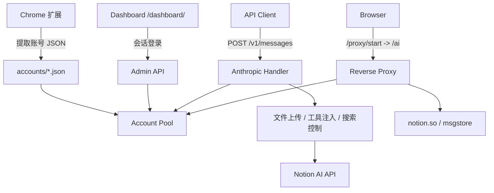

<div align="center">
  <h1>notion-manager</h1>
  <p><strong>Notion AI 多账号池、Dashboard 与本地协议代理</strong></p>
  <p>将多个 Notion 账号集中管理，通过一个本地入口实现账号池化、额度监控、API 代理和 Web 代理。</p>

  <p>
    
    
    
    
  </p>

  <p>
    <a href="#核心能力">核心能力</a> •
    <a href="#系统架构">系统架构</a> •
    <a href="#安装与启动">安装与启动</a> •
    <a href="#详细文档">详细文档</a>
  </p>

  <p>
    <a href="./README.md">English</a> |
    <strong>简体中文</strong>
  </p>
</div>

---

<p align="center">
  
</p>

**notion-manager** 是一个本地运行的 Notion AI 管理工具。它通过自带的 Chrome 扩展提取 Notion 会话，构建多账号池，在后台自动刷新额度与模型状态，并对外提供三个入口：

- `Dashboard`：查看账号状态、刷新额度、切换搜索开关、打开指定账号代理
- `Reverse Proxy`：在本地浏览器中直接使用完整的 Notion AI 页面
- `Anthropic Messages API`：通过 `POST /v1/messages` 以标准协议调用 Notion AI

## 核心能力

### 1. 多账号池与自动故障转移

- 从 `accounts/` 目录加载任意数量的账号 JSON
- 按账号剩余额度优先分配请求，而不是简单随机轮询
- 账号额度耗尽后自动跳过，付费账号在后续刷新时可恢复
- 研究模式会单独选择更适合的账号，优先避开研究额度已紧张的账号
- 配额和已发现模型会持久化回写到账号 JSON

### 2. Dashboard 管理面板

- 内置 React Dashboard，入口为 `/dashboard/`
- 支持密码登录、会话维持与登出
- 查看账号详情、额度、计划类型、可用模型和刷新状态
- 可触发手动刷新，并在页面内切换 `enable_web_search`、`enable_workspace_search`、`debug_logging`
- 可一键打开“最佳账号”代理，或指定某个邮箱对应的账号打开代理可实现原版对话。

### 3. 本地 Notion Web 反向代理

- 入口为 `/ai`
- 通过 `/proxy/start` 为指定账号创建会话，再进入完整的 Notion AI Web 界面
- 自动注入账号 Cookie，不需要在代理页重新登录
- 转发 Notion HTML、`/api/*`、静态资源、`msgstore` 和 WebSocket
- 会动态改写 `CONFIG.domainBaseUrl`，并过滤分析脚本

### 4. Anthropic 协议兼容 API

- 提供 `POST /v1/messages`
- 同时支持 `Authorization: Bearer <api_key>` 和 `x-api-key: <api_key>`
- 支持流式与非流式响应
- 支持 Anthropic `tools`
- 支持图片、PDF、CSV 文件内容块，自动走 Notion 上传链路
- 请求里未指定 `model` 时，自动回退到 `proxy.default_model`

<p align="center">
  <br>
  <em>兼容 <a href="https://github.com/CherryHQ/cherry-studio">Cherry Studio</a> — 多模型桌面客户端</em>
</p>

### 5. 研究模式与搜索控制

- 使用 `researcher` 或 `fast-researcher` 作为模型名即可触发研究模式
- 研究模式会流式输出 thinking 块和最终报告文本
- 普通模型支持联网搜索与工作区搜索
- 搜索开关优先级为：请求头覆盖 > Dashboard / `config.yaml` > 默认值

### 6. Chrome 扩展提取账号

- 扩展位于 `chrome-extension/`
- 可从当前登录的 `notion.so` 会话中提取：
  - `token_v2`
  - `full_cookie`
  - `user_id` / `space_id`
  - `client_version`
  - 当前可用模型列表
- 生成的 JSON 可直接放入 `accounts/` 使用

## 系统架构



## 安装与启动

### 前置要求

- Go `1.25` 或更高版本
- Chrome / Chromium，用于加载扩展并提取账号
- 至少一个可用的 Notion 账号

仓库已经包含内嵌好的 Dashboard 前端资源；如果你只是运行服务，不需要先编译前端。

### 1. 提取账号配置

1. 打开 Chrome 扩展管理页：`chrome://extensions`
2. 开启“开发者模式”
3. 选择“加载已解压的扩展程序”，指向仓库内的 `chrome-extension/`
4. 打开任意已登录的 `https://www.notion.so/`
5. 点击扩展中的“提取配置”
6. 将结果保存到 `accounts/<你的名字>.json`

目录示例：

```text
accounts/
  alice.json
  team-a.json
  backup.json
```

### 2. 配置 `config.yaml`

复制示例配置并按需修改：

```bash
cp example.config.yaml config.yaml
```

- `server.port` 决定服务监听端口
- `server.admin_password` 可手动设置，也可留空由程序自动生成

也可以跳过这一步 —— 服务会以默认值启动，自动生成 `config.yaml`（包含随机 API Key 和管理密码）。

注意：

- 如果 `server.api_key` 为空，启动时会自动生成并回写到 `config.yaml`
- 如果 `server.admin_password` 为空，启动时会自动生成随机密码并打印到控制台，哈希后写回 —— 请务必保存首次启动时显示的明文密码
- 如果 `server.admin_password` 是明文，启动时会自动替换为带盐的 SHA256 哈希

### 3. 启动服务

推荐直接运行 Go 入口：

```bash
go run ./cmd/notion-manager
```

如果你修改了 `web/` 前端源码，请在 `web/` 目录执行 `npm run build`，再把产物同步到 `internal/web/dist/`。

### 4. 启动后验证

下面示例使用 `example.config.yaml` 中的端口 `3000`。如果没有 `config.yaml`，默认端口为 `8081`。

```bash
# 健康检查，无需认证
curl http://localhost:3000/health
```

```bash
# 打开 Dashboard
http://localhost:3000/dashboard/
```

```bash
# 通过 Anthropic Messages API 调用
curl http://localhost:3000/v1/messages \
  -H "Authorization: Bearer <api_key>" \
  -H "Content-Type: application/json" \
  -d '{
    "model": "sonnet-4.6",
    "max_tokens": 512,
    "messages": [
      { "role": "user", "content": "你好，介绍一下当前可用能力。" }
    ]
  }'
```

## 详细文档

- [API 接入](docs/api_cn.md) — 标准请求、搜索控制、文件上传、研究模式
- [Dashboard 与代理](docs/dashboard_cn.md) — 登录认证、代理会话流程
- [配置说明](docs/configuration_cn.md) — 完整配置参考、端点列表、项目结构、使用建议

## 许可证

本项目采用 [CC BY-NC-SA 4.0](https://creativecommons.org/licenses/by-nc-sa/4.0/) 许可证，仅限非商业用途。
